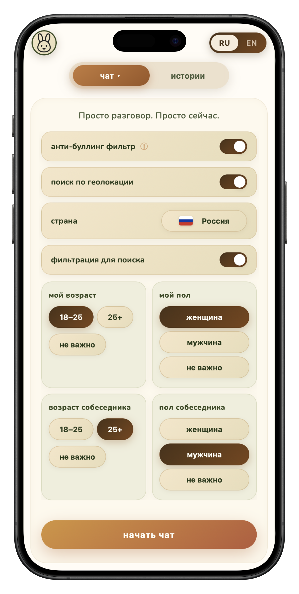
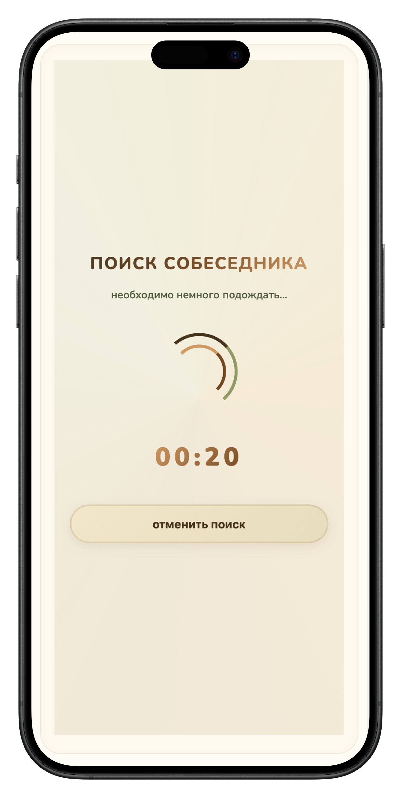
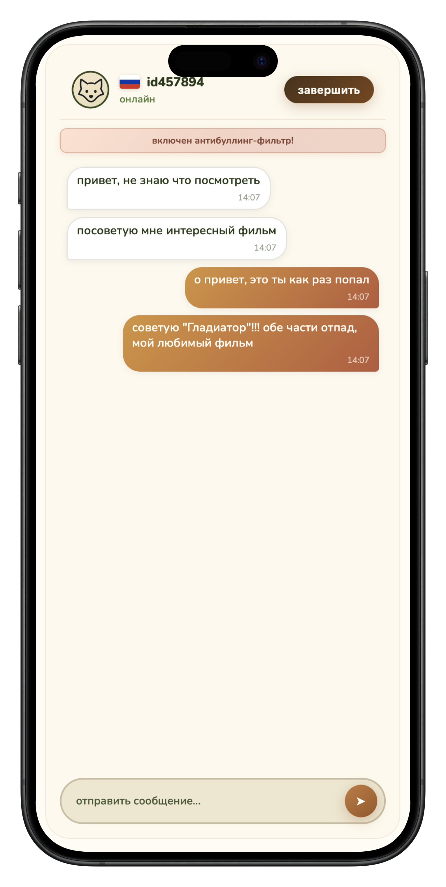
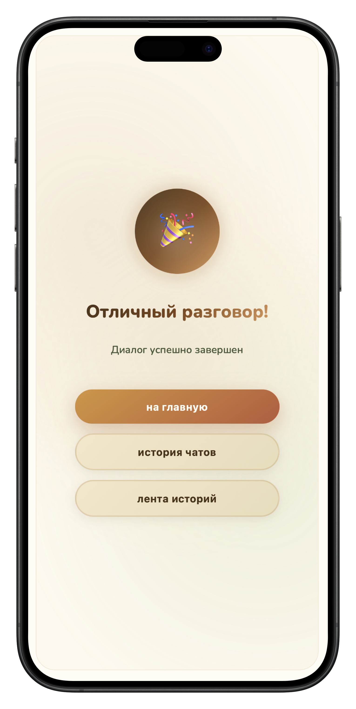
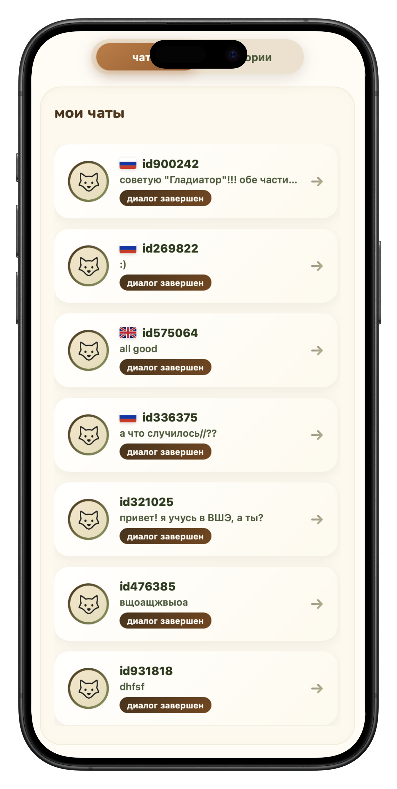
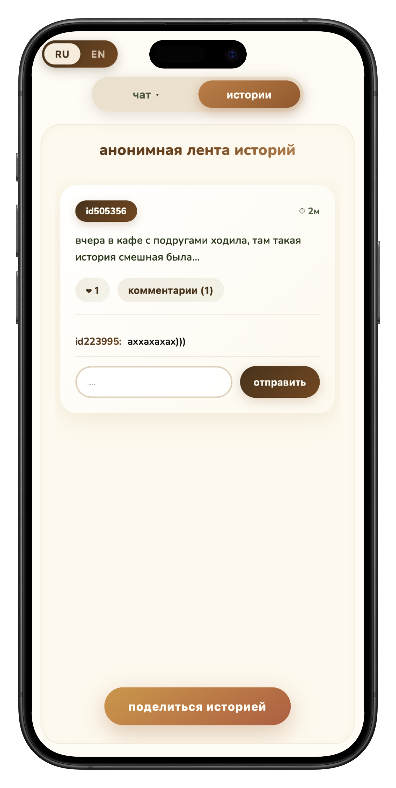

# SideTalk

SideTalk — это fullstack-приложение для анонимного общения в реальном времени, с быстрым подбором собеседника, легким интерфейсом.

Идея продукта: пользователь переходит на веб сайт, при желании задает фильтры, запускает поиск, получает случайного собеседника и начинает диалог. Дополнительно в проекте есть анонимная лента историй, где можно публиковать короткие посты, ставить лайки и оставлять комментарии.

## Скриншоты

<p align="center">
  
  
  
</p>

<p align="center">
  
  
  
</p>

## Что умеет приложение

- Подбирает собеседников в реальном времени через WebSocket
- Поддерживает поиск по геофильтру
- Поддерживает фильтры по параметрам собеседника
- Сохраняет историю чатов локально для текущего пользователя
- Позволяет публиковать анонимные истории
- Поддерживает лайки и комментарии в ленте историй
- Включает антибуллинг-фильтр для оскорбительных сообщений
- Работает на русском и английском
- Оптимизировано в первую очередь под мобильные устройства

## Что реализовано

С инженерной точки зрения SideTalk интересен тем, что в нем пересекаются сразу несколько непростых задач:

- real-time взаимодействие между клиентом и сервером
- логика матчинга с правилами совместимости
- mobile UX и работа в браузерах
- синхронизация локального состояния и данных с сервера
- базовая модерация и защита от токсичных сообщений
- деплой через Docker и reverse proxy

## Технологический стек

### Frontend

- React 19
- React Router
- Vite
- CSS без UI-фреймворков
- WebSocket API
- localStorage и sessionStorage для клиентского состояния

### Backend

- Go
- Chi Router
- Gorilla WebSocket
- SQLX
- PostgreSQL
- Goose migrations

### Инфраструктура

- Docker
- Docker Compose
- Nginx

## Структура проекта

### Frontend

Фронтенд находится в [frontend_react](/Users/luvcoca/Desktop/kursovaya/frontend_react).

Ключевые директории:

- [src/app](/Users/luvcoca/Desktop/kursovaya/frontend_react/src/app) — общий каркас приложения, роутинг, layout
- [src/pages](/Users/luvcoca/Desktop/kursovaya/frontend_react/src/pages) — страницы: главная, поиск, чат, завершение чата, мои чаты, истории
- [src/api](/Users/luvcoca/Desktop/kursovaya/frontend_react/src/api) — работа с REST API и WebSocket
- [src/context](/Users/luvcoca/Desktop/kursovaya/frontend_react/src/context) — глобальное состояние приложения
- [src/utils](/Users/luvcoca/Desktop/kursovaya/frontend_react/src/utils) — вспомогательная логика, local persistence, антибуллинг
- [src/shared](/Users/luvcoca/Desktop/kursovaya/frontend_react/src/shared) — словари, переводы, флаги, аватары, банворды

### Backend

Бэкенд находится в [backend](/Users/luvcoca/Desktop/kursovaya/backend).

Ключевые директории:

- [cmd/main.go](/Users/luvcoca/Desktop/kursovaya/backend/cmd/main.go) — точка входа приложения
- [internal/handler](/Users/luvcoca/Desktop/kursovaya/backend/internal/handler) — HTTP- и WebSocket-обработчики
- [internal/usecase](/Users/luvcoca/Desktop/kursovaya/backend/internal/usecase) — бизнес-логика: матчинг, чат, модерация
- [internal/repo](/Users/luvcoca/Desktop/kursovaya/backend/internal/repo) — слой доступа к данным
- [migrations](/Users/luvcoca/Desktop/kursovaya/backend/migrations) — SQL-миграции базы данных

## Основные возможности

### 1. Анонимный чат в реальном времени

Главный сценарий приложения это быстрый анонимный чат. Фронтенд открывает WebSocket-соединение, идентифицирует пользователя, отправляет запрос на поиск и получает с бэкенда ID общей chat session, если находится подходящий собеседник.

Основные файлы:

- [websocket.js](/Users/luvcoca/Desktop/kursovaya/frontend_react/src/api/websocket.js)
- [SearchingPage.jsx](/Users/luvcoca/Desktop/kursovaya/frontend_react/src/pages/SearchingPage/SearchingPage.jsx)
- [ChatPage.jsx](/Users/luvcoca/Desktop/kursovaya/frontend_react/src/pages/ChatPage/ChatPage.jsx)
- [ws_hub.go](/Users/luvcoca/Desktop/kursovaya/backend/internal/usecase/ws_hub.go)

### 2. Логика подбора собеседника

На сервере есть очередь ожидающих пользователей. Бэкенд подбирает пары на основе совместимости.

Что учитывается:

- геофильтр
- дополнительные пользовательские фильтры
- нормализация названий стран между локалями
- корректная переустановка пользователя в очередь, если он запускает поиск повторно

Основная логика находится в:

- [matching.go](/Users/luvcoca/Desktop/kursovaya/backend/internal/usecase/matching.go)

Эта часть отдельно покрыта тестами на корректность матчинга и работу с несколькими пользователями.

### 3. Лента историй

В проекте есть легкая анонимная лента, где пользователь может:

- опубликовать историю
- увидеть истории с бэкенда
- поставить или убрать лайк
- оставить комментарий

Интерфейс также умеет обновляться в фоне, чтобы лента не требовала ручной перезагрузки страницы.

Основные файлы:

- [StoriesPage.jsx](/Users/luvcoca/Desktop/kursovaya/frontend_react/src/pages/StoriesPage/StoriesPage.jsx)
- [storiesApi.jsx](/Users/luvcoca/Desktop/kursovaya/frontend_react/src/api/storiesApi.jsx)

### 4. Антибуллинг-фильтр

Одна из важных продуктовых фич проекта: фильтрация токсичных и оскорбительных сообщений.

Если антибуллинг включен:

- оскорбительное сообщение не уходит собеседнику
- отправитель видит локальный статус “сообщение не отправлено”
- фильтр работает и по готовым фразам, и по префиксам слов
- учитываются подмены символов, смешанные раскладки и похожие буквы

Это позволяет ловить не только прямые оскорбления, но и простые попытки обхода фильтра.

Основные файлы:

- [antiBullying.js](/Users/luvcoca/Desktop/kursovaya/frontend_react/src/utils/antiBullying.js)
- [banwords.js](/Users/luvcoca/Desktop/kursovaya/frontend_react/src/shared/banwords.js)
- [anti_bullying.go](/Users/luvcoca/Desktop/kursovaya/backend/internal/usecase/anti_bullying.go)

## Инженерные акценты

### Mobile-first UX

Проект в первую очередь рассчитан на мобильных пользователей. Поэтому значительная часть работы была связана не просто с визуальным дизайном, а с реальным поведением интерфейса в браузере:

- плавное появление и скрытие клавиатуры
- фиксированная шапка чата при вводе
- корректная работа на iPhone-подобных устройствах
- уменьшение скачков интерфейса при изменении viewport
- полноэкранный режим чата на телефонах

Это в основном реализовано в:

- [ChatPage.jsx](/Users/luvcoca/Desktop/kursovaya/frontend_react/src/pages/ChatPage/ChatPage.jsx)
- [styles.css](/Users/luvcoca/Desktop/kursovaya/frontend_react/src/styles.css)
- [index.html](/Users/luvcoca/Desktop/kursovaya/frontend_react/index.html)

### Устойчивый WebSocket-поток

WebSocket в мобильных браузерах редко ведет себя идеально, особенно при смене вкладок, реконнектах, доменных прокси и работе Safari. Поэтому клиентская логика построена так, чтобы не терять состояние поиска и уметь восстанавливаться после переподключения.

Это одна из тех частей проекта, где было больше всего реального дебага и продуктовой доводки.

### Понятное разделение ответственности

Несмотря на компактный размер проекта, код организован так, чтобы его можно было спокойно поддерживать:

- UI и сценарии — в React-страницах
- общее состояние — в context
- сетевое взаимодействие — в `api`
- бизнес-правила — в Go use cases
- хранение и миграции — в repo и SQL-миграциях

Это помогает развивать проект без превращения его в монолитный набор случайных файлов.

## На что я делала упор как разработчик

Если коротко, то мой подход в этом проекте был таким:

- относиться к приложению как к реальному продукту, а не к учебному прототипу
- уделять внимание UX на настоящих мобильных браузерах, а не только в desktop Chrome
- работать не только с happy path, но и с реальными edge cases: реконнекты, очередь поиска, блокировка сообщений, мобильный viewport, домены и reverse proxy
- держать код в понятной структуре, без лишнего усложнения

## Локальный запуск

### Вариант 1. Через Docker

Из корня проекта:

```bash
docker compose up --build
```

После запуска:

- frontend: `http://localhost:3090`
- backend: `http://localhost:8080`
- postgres: `localhost:5432`

### Вариант 2. Отдельно фронтенд и бэкенд

Frontend:

```bash
cd frontend_react
npm install
npm run dev
```

Backend:

```bash
cd backend
go run ./cmd
```

Для работы части с историями и хранением данных нужен PostgreSQL.

## Проверка и тесты

Backend tests:

```bash
cd backend
go test ./...
```

Frontend production build:

```bash
cd frontend_react
npm run build
```

## Деплой

Приложение можно разворачивать за Nginx с проксированием WebSocket.

Важно учитывать:

- `/ws` должен проксироваться именно как WebSocket upgrade
- при работе с собственным доменом reverse proxy влияет на стабильность не меньше, чем код приложения

Конфиг фронтового proxy находится здесь:

- [frontend_react/nginx.conf](/Users/luvcoca/Desktop/kursovaya/frontend_react/nginx.conf)

## Что можно улучшать дальше

Если продолжать развитие проекта, я бы двигалась в сторону:

- более явной системы идентификации или легкой репутации пользователей
- переноса части локальной истории чатов в постоянное серверное хранилище
- автоматизированных frontend-тестов
- улучшения observability для WebSocket и mobile-ошибок
- расширения moderation tooling и административных сценариев
